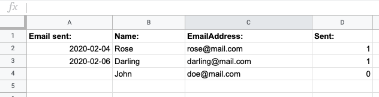

# google-appscript
## Appscript templates ready to use in your daily Google Sheet battles

Here you will find a set of code samples that can fill your Google Sheets with additional functionality by using Google AppScript.

## How to use: 
* Before using AppScript, recommend to get famillar with it: 
* https://developers.google.com/apps-script/overview

## Templates:
### ImportSheet template:
* Used to determine the sheet(s) and tab(s) your code should work in, necessary for all appscript projects.
* There are two options for determining wanted sheet: \
option1 - you can use this option if you are working with tab(s) in one spreadsheet \
option2 - recommend to use this option if you are working with multiple spreadsheets 
* After selecting one of the options to use, don't forget to delete the other one.

### addFormulas template: 
* Contains examples of how sheet formulas can be inserted, updated and managed in selected sheet ranges.
* Pay attention to all punctuation symbols in formulas - it can easily mess up your formula and stop it from working; 
* By saving variables with sheet ranges and other elements (even formulas) that repeats several times, you can easily maintain it 
and update when needed. All formulas and functions that reuse those elements will be updated automatically.

### ChangeTextColor template:
* You can change font color in selected range when the condition is met (conditional formatting in a fancy way). 
This might seem useless if you are working with one sheet, but with this you can also format the second(and 3rd, 4th, etc.) sheet based on 
conditions in the first one. 
* If you want to modify multiple sheets, then don't forget to declare all sheets and its ranges that should be modified (see ImportSheet template)

### Checkboxes template:
* You can determine the range to which the checkboxes should be added. 
* Just like with ChangeTextColoor template, here you can also add conditions and/or modify several sheets at a time.

### emailAutomation template: 
* This template can enable you to send emails automatically, based on the condition set. There's a lot of possible modifications and conditionns that can be  added to it, this template contains just the main part of email sending automation.
* Note that for this template to work you will need a sheet with a table that contains recipient email addresses.
* Note that all emails will be sent from your gmail account.
* Keep in mind that column numbers for variables 'emailAddress' and 'sent' are counted from 0;
* Example of a sheet table:

### createFolder template: 
* This template can help you create new folders or folder structure.
* Please take a note that this functionality desn't work on shared drives.

### customMenu template: 
* This template adds a custom menu in your sheet from which you can call other functions

### dataValidationList template:
* This template takes a list from set range in one sheet and applies data validation from a list in another range.
* This might not be one of the most needed appscript templates sice you can easily do it in google sheet itself, but this could be handy having an array from other sources than google sheet and wanting to use it for data validation. 
  * For this use case, you will need to define a range to which data validation should apply to and set an array to .requireValueInRange(array).

### UI_textInput template:
* Shows a popup with text input field requesting the user to enter his/her name.
* You can edit the pop up text and button.

### insertNewSheet template:
* You can set the script to add a new tab in a sheet using a template.

### Timestamp template:
* This function is triggered once someone edits the sheet to which it is linked.
* It sets the timestamp to a last row in column A, but all this can be edited. 
* Again, might not be the most interesting function, but this method itself can be handy adding other data or formulas.

### MultichoiceMenu_part1 and MultichoiceMenu_part2 templates
* For template to work you will need both of these files.
* This template will enable multichoice data validation in your sheet.
* How to use it: 
 * select a cell with data validation on your sheet;
 * click 'Multiple Choice', then 'Show Dialog' item in top menu of the sheet;
 * a sidebar should open with all avalable options for selected cell;
 * choose wanted options by marking checkboxes;
 * click 'fill current' button;
* If you want, you can open the sidebar first and then select the wanted cell, then click 'get validation from current' to get available options.

### Frozen template:
* You can set the number of rows that should be frozen. 

### Asana API template:
* This one is for those, who are already using Asana and want to fetch some data from it.
* This template helps to fetch the data using Asana's API and place it in Google sheet, but before you try working with it, I recommend to get to know that API and how it works. You will also need to generate a personal access token, more information how to do it is here: https://developers.asana.com/docs/authentication-quick-start 
* More information about Asana's API: https://developers.asana.com/docs
* API Explorer: https://developers.asana.com/explorer 

